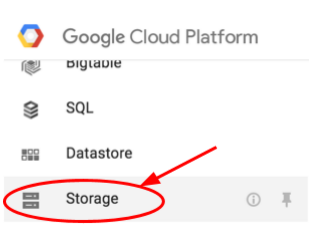
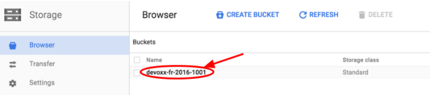
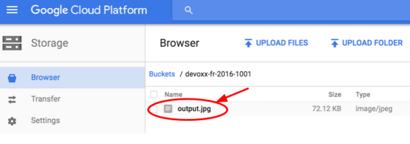

// JBoss, Home of Professional Open Source
// Copyright 2016, Red Hat, Inc. and/or its affiliates, and individual
// contributors by the @authors tag. See the copyright.txt in the
// distribution for a full listing of individual contributors.
//
// Licensed under the Apache License, Version 2.0 (the "License");
// you may not use this file except in compliance with the License.
// You may obtain a copy of the License at
// http://www.apache.org/licenses/LICENSE-2.0
// Unless required by applicable law or agreed to in writing, software
// distributed under the License is distributed on an "AS IS" BASIS,
// WITHOUT WARRANTIES OR CONDITIONS OF ANY KIND, either express or implied.
// See the License for the specific language governing permissions and
// limitations under the License.

### Managing Batched / Run-Once Jobs
Duration: 15:00

So far, the lab has been showing how to run long running serving processes. What if you need to run a one-time job, such as a batch process, or simply leveraging the cluster to compute a result (like computing digits of Pi)? You shouldn't use Replication Controllers, Replica Set, or Deployments to run a job that is expected exit once it completes the computation (otherwise, upon exit, it'll be restarted again!).

Kubernetes supports running these run-once jobs, which it'll create one or more pods and ensures that a specified number of them successfully terminate. When a specified number of successful completions is reached, the job itself is complete. In many cases, you'll have run a job that only need to complete once.

For this lab, we'll run a job that uses link:http://googleresearch.blogspot.fr/2015/07/deepdream-code-example-for-visualizing.html[Google DeepDream] to produce a dreamy picture. The job will retrieve an image from the web, processes it with Google DeepDream, and then output the processed image into a Google Cloud Storage bucket, like this:

First, create a Google Cloud Storage bucket that will be used to store the image. Bucket names are globally unique. Use the Project ID as the bucket name to minimize conflicts with other bucket names:

[source,subs="normal,attributes"]
----
$ *gsutil mb gs://<project-id>
Creating gs://<project-id>/...
----

Next, find an interesting image to process. Since the processing time will increase with the size of the image, please find a JPG image that's no larger than 640px by 480px large. Make sure you grab the public URL to the image, e.g., this one: https://farm2.staticflickr.com/1483/25947843790_7cf8d5e59c_z_d.jpg

Then, you can launch a job directly from the command line:

[source,subs="normal,attributes"]
----
$ *kubectl run deepdream-1 --restart=Never \
      --image=saturnism/deepdream-cli-gcs -- \
      -i 1 --source=_<an image url>_ \
      --bucket=_<project_id>_ --dest=output.jpg*
job "deepdream-1" created
----

This job should finish relatively quickly. You'll be able to see the status of the job via the command line:

[source,subs="normal,attributes"]
----
$ *kubectl get jobs*
NAME          DESIRED   SUCCESSFUL   AGE
deepdream-1   1         0            37s*
----

Wait until the successful count is 1. Once the job finishes, browse to your Google Cloud Storage bucket and check the output.

First, navigate to *Storage*:

Then, navigate to the bucket:

You should see the _output.jpg_, click on it and see the output.

This first iteration is probably not very impressive due to the configuration parameter we used.

Now that we know this job works, let's run a longer job:

[source,subs="normal,attributes"]
----
$ *kubectl run deepdream-2 --restart=Never \
      --image=saturnism/deepdream-cli-gcs -- \
      -o 6 -l conv2/3x3 --source=<an image url> \
      --bucket=<project_id> --dest=output-2.jpg*
job "deepdream-2" created
----

This job will take a couple of minutes to complete. While it's running, you can see the pod that was started, and also tail its logs (recall how you can do that via the command line).

Last, but not least, even though we launched the jobs from the command lines, you can always write a Job descriptor as a YAML or JSON file and submit those descriptors as well.
