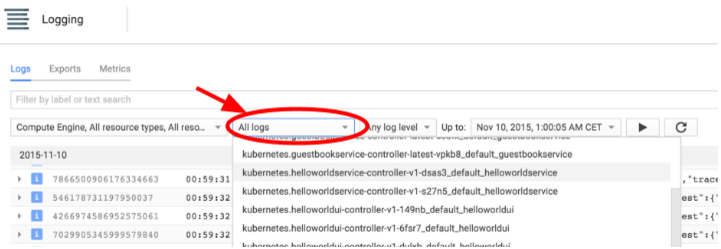

// JBoss, Home of Professional Open Source
// Copyright 2016, Red Hat, Inc. and/or its affiliates, and individual
// contributors by the @authors tag. See the copyright.txt in the
// distribution for a full listing of individual contributors.
//
// Licensed under the Apache License, Version 2.0 (the "License");
// you may not use this file except in compliance with the License.
// You may obtain a copy of the License at
// http://www.apache.org/licenses/LICENSE-2.0
// Unless required by applicable law or agreed to in writing, software
// distributed under the License is distributed on an "AS IS" BASIS,
// WITHOUT WARRANTIES OR CONDITIONS OF ANY KIND, either express or implied.
// See the License for the specific language governing permissions and
// limitations under the License.

### Google Cloud Logging
Duration: 3:00

During the lab, you’ve used _kubectl logs_ command to retrieve the logs of a container running inside of Kubernetes.  When you use Google Container Engine to run managed Kubernetes clusters, all of the logs are automatically forwarded and stored in Google Cloud Logging.  You can see all the log output from the pods by navigating to *Stackdriver > Logging*, and find the logs by pod name:

From here, you can optionally export the logs into Google BigQuery for further log analysis, or setup https://cloudplatform.googleblog.com/2015/10/create-metrics-alerts-and-dashboards-based-on-your-Google-Cloud-logs.html[log-based] alerting. We won’t get to do this during the lab today.
