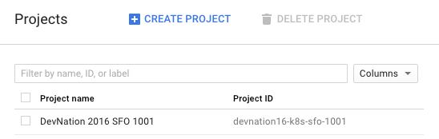
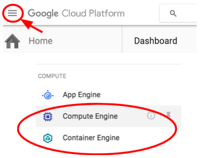
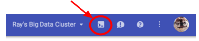

// JBoss, Home of Professional Open Source
// Copyright 2016, Red Hat, Inc. and/or its affiliates, and individual
// contributors by the @authors tag. See the copyright.txt in the
// distribution for a full listing of individual contributors.
//
// Licensed under the Apache License, Version 2.0 (the "License");
// you may not use this file except in compliance with the License.
// You may obtain a copy of the License at
// http://www.apache.org/licenses/LICENSE-2.0
// Unless required by applicable law or agreed to in writing, software
// distributed under the License is distributed on an "AS IS" BASIS,
// WITHOUT WARRANTIES OR CONDITIONS OF ANY KIND, either express or implied.
// See the License for the specific language governing permissions and
// limitations under the License.

## Initial setup
Duration: 5:00

- The instructor will provide you with a temporary username / password to login into Google Cloud Console.
- Login into the Cloud Console: link:https://console.cloud.google.com/[] with the provided credentials.
- Make sure you select the project *{projectpattern}* that was pre-created for you.

- *Very Important* - Visit each of these pages to kick-off some initial setup behind the scenes, such as enabling the Compute Engine API, and the Container Engine API:

  Compute → Compute Engine → VM Instances
  Compute → Container Engine → Container cluster

- You might see a new task appears on the bottom right corner, you don’t need to wait for them to finish to keep going.

Once the operations completes, you will do most of the work from the link:https://cloud.google.com/shell/#how_do_i_get_started[Google Cloud Shell], a command line environment running in the Cloud. This Debian-based virtual machine is loaded with all the development tools you’ll need (_docker, gcloud, kubectl and others_) and offers a persistent 5GB home directory. Open the Google Cloud Shell by clicking on the icon on the top right of the screen:

Finally, using Cloud Shell, set the default zone and project configuration:
include::custom/config-region.adoc[]

You can pick and choose different zones too. Learn more about zones in link:https://cloud.google.com/compute/docs/regions-zones/regions-zones[Regions & Zones documentation].

NOTE: When you run gcloud on your own machine, the config settings would’ve been persisted across sessions.  But in Cloud Shell, you will need to set this for every new session / reconnection.

