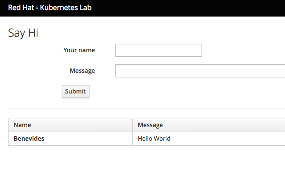

// JBoss, Home of Professional Open Source
// Copyright 2016, Red Hat, Inc. and/or its affiliates, and individual
// contributors by the @authors tag. See the copyright.txt in the
// distribution for a full listing of individual contributors.
//
// Licensed under the Apache License, Version 2.0 (the "License");
// you may not use this file except in compliance with the License.
// You may obtain a copy of the License at
// http://www.apache.org/licenses/LICENSE-2.0
// Unless required by applicable law or agreed to in writing, software
// distributed under the License is distributed on an "AS IS" BASIS,
// WITHOUT WARRANTIES OR CONDITIONS OF ANY KIND, either express or implied.
// See the License for the specific language governing permissions and
// limitations under the License.

### Accessing the frontend
Duration: 5:00

When we deployed the frontend, we needed to specify that *the service needs to be externally accessible*. In Kubernetes, you can instruct the underlying infrastructure to create an external load balancer, by specifying the Service Type as a _LoadBalancer_.

You can see it in the frontend-service.yaml:

[source,yaml,subs="normal,attributes"]
----
include::../kubernetes/frontend-service.yaml[]
----

Kubernetes *ServiceTypes* allow you to specify what kind of service you want. The default and base type is *ClusterIP*, which exposes a service to connection from inside the cluster. *_NodePort_ and _LoadBalancer_ are two types that expose services to external traffic*.

Valid values for the ServiceType field are:

- *ClusterIP*: use a cluster-internal IP only - this is the default and is discussed above. Choosing this value means that you want this service to be reachable only from inside of the cluster.
- *NodePort*: on top of having a cluster-internal IP, expose the service on a port on each node of the cluster (the same port on each node). You’ll be able to contact the service on any <NodeIP>:NodePort address.
- *LoadBalancer*: on top of having a cluster-internal IP and exposing service on a NodePort also, ask the cloud provider for a load balancer which forwards to the Service exposed as a <NodeIP>:NodePort for each Node.

Note that we have specified *LoadBalancer*, but it only works on cloud providers which support external load balancers. For example, in Google Cloud Platform (GCE), a load balancer will be created asynchronously and a new external ip will be assigned. The external ip address would be available under the field *LoadBalancer Ingress*. Example:

[source, bash, subs="normal,attributes"]
----
$ *kubectl describe service frontend-ui*
Name:                     frontend-ui
Namespace:                myproject
Labels:                   app=frontend-ui
                          lab=kubernetes-lab
Annotations:              <none>
Selector:                 app=frontend-ui
Type:                     LoadBalancer
IP:                       172.30.40.241
External IPs:             172.29.133.81
*LoadBalancer Ingress:     172.29.133.81*
Port:                     http-80	80/TCP
*NodePort:                 http-80	3????/TCP&
Endpoints:                172.17.0.3:8080,172.17.0.4:8080
Session Affinity:         None
Events:                   <none>
----

IMPORTANT: Since CDK doesn't support the creation of external LoadBalancers, you can access the service through the *NodePort*. Kubernetes allocates a port _(default: 30000-32767)_, and each Node in the cluster will proxy that port (the same port number on every Node) into the frontend PODs. Later, in this lab, you will learn an alternative to *NodePorts* and *LoadBalancer*.

First, execute *kubectl describe services frontend-ui* and find out which port (between: 30000-32767) Kubernetes assigned in the CDK node. Once that you have the NodePort, you can access the guestbook via the IP address and port number by navigating the browser to http://1.2.3.4:<NODEPORT>/. 

Example: http://192.168.64.11:31079/

NOTE: The NodePort (31079) is a random value. You should use the value described in NodePort via _kubectl describe service frontend-service_. The IP is the external ip of the Kubernetes Cluster

You should see something like this:

