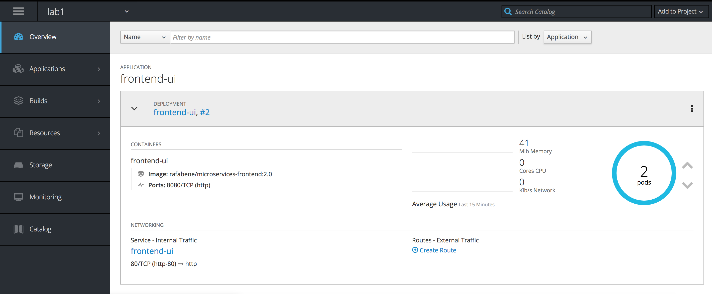
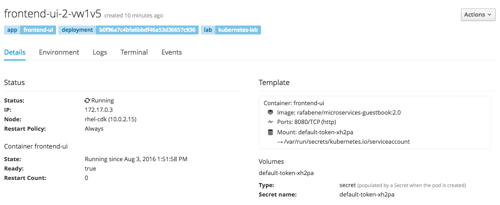
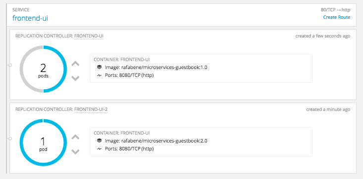

// JBoss, Home of Professional Open Source
// Copyright 2016, Red Hat, Inc. and/or its affiliates, and individual
// contributors by the @authors tag. See the copyright.txt in the
// distribution for a full listing of individual contributors.
//
// Licensed under the Apache License, Version 2.0 (the "License");
// you may not use this file except in compliance with the License.
// You may obtain a copy of the License at
// http://www.apache.org/licenses/LICENSE-2.0
// Unless required by applicable law or agreed to in writing, software
// distributed under the License is distributed on an "AS IS" BASIS,
// WITHOUT WARRANTIES OR CONDITIONS OF ANY KIND, either express or implied.
// See the License for the specific language governing permissions and
// limitations under the License.

### A console to manage your Kubernetes Cluster
Duration: 10:00

Until now we have been using Kubernetes CLI (_kubectl_) to manage our cluster. Wouldn't it be good if we could visualize/manage our cluster in a user/interface?

Let's take a look in OpenShift console.

NOTE: Don't worry. This is still a Kubernetes lab! OpenShift runs on top of Kubernetes but adds features like deployments, source-to-image, user management, routes, etc.

Access https://OPENSHIFT_IP:8443 

[NOTE]
====
Accept the self-signed HTTPS certificate. 

Login with the credentials:

- username: *developer*
- password: *developer*
====

Click on *OpenShift sample project* and now you will see all Kubernetes objects that you have created with kubectl command. This happens because OpenShift is built on top of Kubernetes.

Take some minutes to explore this interface.

- Click on the Service and Deployment links and see the details.
- Click on the POD number and see the list of PODS. Select one POD to explore.
- Explore the POD details and the other tabs (Environment, Logs, Terminal and Events)
- In the right top corner, click in the gray _Actions_ button and check that you can also edit the YAML file.

NOTE: The blue bars on top of the pods are "Label filters" that were applied to select just the specific pods for the *ReplicationController* that you clicked.

Back to the *Overview* page and check that you can scale up and scale down the number of the pods simply by clicking on the gray arrows on the right hand side of the pods number.

Let's perform a rolling-update in the shell and see how it behaves visually in OpenShift. Execute the following command and return to the OpenShift console in the browser:

[source, bash, subs="normal,attributes"]
----
$ *kubectl set image  deployment/frontend-ui frontend-ui=rafabene/microservices-frontend:1.0*
deployment "frontend-ui" image updated
----

#### A word about oc command

You will be introduced now to the _oc_ command. You can think of it as a super set of _kubectl_. You can use it to do almost all operations that you did with _kubectl_. Let's try:

[source, bash, subs="normal,attributes"]
----
$ *oc get pods*
NAME                               READY     STATUS    RESTARTS   AGE
frontend-ui-anbox                  1/1       Running   0          1h
frontend-ui-l7jbo                  1/1       Running   0          1h
guestbook-service-h4fvr            1/1       Running   0          1h
helloworld-service-vertx-1-738ux   1/1       Running   0          5m
mysql-yhl82                        1/1       Running   0          1h

$ *oc get rc*
NAME                         DESIRED   CURRENT   AGE
frontend-ui                  2         2         1h
guestbook-service            1         1         1h
helloworld-service-vertx-1   1         1         5m
mysql                        1         1         1h

$ *oc get service*
NAME                       CLUSTER-IP       EXTERNAL-IP   PORT(S)                      AGE
frontend-ui                172.30.212.103                 80/TCP                       9h
guestbook-service          172.30.140.61    <none>        8080/TCP                     9h
helloworld-service-vertx   172.30.7.161     <none>        8080/TCP,8778/TCP,9779/TCP   8h
mysql                      172.30.249.144   <none>        3306/TCP                     9h

$ *oc describe service frontend-ui*
Name:			frontend-ui
Namespace:		sample-project
Labels:			app=frontend-ui,lab=kubernetes-lab
Selector:		app=frontend-ui
Type:			LoadBalancer
IP:			172.30.212.103
Port:			http-80	80/TCP
NodePort:		http-80	32186/TCP
Endpoints:		172.17.0.2:8080,172.17.0.5:8080
Session Affinity:	None
No events.

$ *oc delete pod frontend-ui-?????*
pod "frontend-ui-?????" deleted
----

Now let's use _oc_ to:

- Easily set a ReadinessProbe.

To create a *ReadinessProbe* with _oc_ command, execute:

[source, bash, subs="normal,attributes"]
----
$ *oc set probe deployment helloworld-service-vertx --readiness --get-url=http://:8080/api/hello/Kubernetes*
deployment "helloworld-service-vertx" updated
----

This was much easier than the previous time, right?
You can use _oc get deployment helloworld-service-vertx -o yaml_ to see the configuration inside the *DeploymentConfig* object.

TIP: You can also use *oc set probe deployment helloworld-service-vertx --readiness --remove* to remove the *ReadinessProbe* using *oc* command.

- Create a route to frontend-ui.

Now let's create a route and expose the service. But first let's understand what is a *Route*.
Remember that we needed to execute *kubectl describe service frontend-ui* to get the *NodePort*?
A *Route* uses the port 80 of OpenShift and "routes" the requests based on the defined hostname.
Let's see how it works. Execute:

WARNING: Replace OPENSHIFT_IP by the IP of the OpenShift cluster. Example: 192.168.64.11

[source, bash, subs="normal,attributes"]
----

$ *oc expose service frontend-ui \
                    --hostname=frontend.OPENSHIFT_IP.nip.io*
route "frontend-ui" exposed
----

Now point your browser to http://frontend.OPENSHIFT_IP.nip.io/

Amazing, right?

TIP: TIP: You can delete the *Route* with the command: *oc delete route frontend-ui*

[NOTE]
====
*How frontend.10.1.2.2.nip.io resolved to 10.1.2.2?*

link:http://www.nip.io/[NIP.IO] allows you to map any IP Address in the following DNS wildcard entries:

- 10.0.0.1.nip.io maps to 10.0.0.1
- app.10.0.0.1.nip.io maps to 10.0.0.1
- customer1.app.10.0.0.1.nip.io maps to 10.0.0.1
- customer2.app.10.0.0.1.nip.io maps to 10.0.0.1
- otherapp.10.0.0.1.nip.io maps to 10.0.0.1

NIP.IO maps *<anything>.<IP Address>*.nip.io to the corresponding *<IP Address>*, even 127.0.0.1.nip.io maps to 127.0.0.1
====