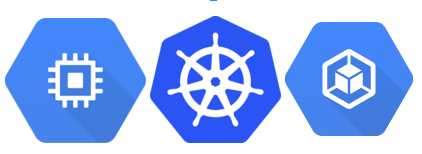

// JBoss, Home of Professional Open Source
// Copyright 2016, Red Hat, Inc. and/or its affiliates, and individual
// contributors by the @authors tag. See the copyright.txt in the
// distribution for a full listing of individual contributors.
//
// Licensed under the Apache License, Version 2.0 (the "License");
// you may not use this file except in compliance with the License.
// You may obtain a copy of the License at
// http://www.apache.org/licenses/LICENSE-2.0
// Unless required by applicable law or agreed to in writing, software
// distributed under the License is distributed on an "AS IS" BASIS,
// WITHOUT WARRANTIES OR CONDITIONS OF ANY KIND, either express or implied.
// See the License for the specific language governing permissions and
// limitations under the License.

## Preface

In the last 3 years, docker and linux containers have become the sensation of the IT industry. The promise of eliminating environment inconsistencies by packaging your software together with all its dependencies (files, libraries, environment variables, runtimes, etc) has driven Linux containers to emerge as a de-facto standard. 

Once your application is wrapped in a container, you don't need to lose time configuring a new environment. Running another "instance" of your application is easy and consumes less computational resources than typical Virtual Machines.

Even though containers consume fewer computational resources, a single machine running a dozen containers is not an ideal scenario for a professional "production environment" --- running many containers on a single machine can lead to several issues. 

Just to mention a few:
 
- The quantity of active containers are limited by the "size" of your hardware
- Unlike a "cloud environment" you can't move the workloads to where you want
- The one machine becomes the SPOF (Single Point of Failure) of your application. 

To achieve a serious "production environment", your Linux containers should be capable of running on more than one single machine, supporting your application's horizontal scaling. In this scenario, features like self-healing, autoscaling, load-balancing, service-discovery, and distributed storage volumes completes the professional touch of your environment. It sounds complicated, but fortunately you can get all of these features from a single technology - Kubernetes.

link:http://kubernetes.io/[Kubernetes] is an open-source project developed by link:https://www.google.com/[Google], with link:https://developers.redhat.com/[Red Hat] at a close second in contributions. Google has over a decade of experience with Linux containers, deploying millions each day. It should be no surprise that Kubernetes' capabilities and maturity have led to its being used as the engine of link:https://www.openshift.com/[OpenShift Enterprise v3]. 

This lab offers developers a hands-on session with Kubernetes, from the basics concepts, to adding Java based microservices, to service scaling, to perform rolling deployments. This is a BYOL (bring your own laptop) session, so bring your Windows, OSX, or Linux laptop and be ready to dig into a tool that promises to be at the forefront of our industry for some time to come.

NOTE: Latest content of this lab is always at https://github.com/redhat-developer-demos/kubernetes-lab[]
