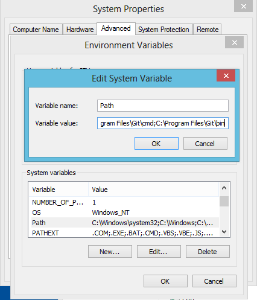

// JBoss, Home of Professional Open Source
// Copyright 2016, Red Hat, Inc. and/or its affiliates, and individual
// contributors by the @authors tag. See the copyright.txt in the
// distribution for a full listing of individual contributors.
//
// Licensed under the Apache License, Version 2.0 (the "License");
// you may not use this file except in compliance with the License.
// You may obtain a copy of the License at
// http://www.apache.org/licenses/LICENSE-2.0
// Unless required by applicable law or agreed to in writing, software
// distributed under the License is distributed on an "AS IS" BASIS,
// WITHOUT WARRANTIES OR CONDITIONS OF ANY KIND, either express or implied.
// See the License for the specific language governing permissions and
// limitations under the License.

## Troubleshooting

### Error from server: the server has asked for the client to provide credentials

If any **kubectl** or **oc** command replies with

====
Error from server: the server has asked for the client to provide credentials
====

Execute:

[source,bash,subs="normal,attributes"]
----
$ *oc login -u openshift-dev -p devel*
----

### Windows vagrant plugin install

When your Windows username contains a space, vagrant will give the following message:

====
 The directory where plugins are installed (the Vagrant home directory) has a space in it. On Windows, there is a bug in Ruby when compiling plugins into directories with spaces. Please move your Vagrant home directory to a path without spaces and try again.
====

The workaround is set the vagrant home in other folder that doesn't contain spaces. You can do that with the following command:

[source,bash,subs="normal,attributes"]
----
C:\> set VAGRANT_HOME=C:\
----

### Windows vagrant ssh

If your Windows doesn't contain *ssh*, vagrant will complain about it. In that case, just install *git for Windows* and add the following values to the PATH environment variable to **C:\Program Files\Git\bin;C:\Program Files\Git\usr\bin**

